# Accessibility reports

## Axcess CI gate

`.github/workflows/axcess-a11y.yml` runs on pull requests and pushes to `staging` and `main`, and can be started by hand from the Actions tab. It:

1. Boots the app in the `test` environment against Postgres 14, loads `db/seeds.rb`, and adds sample collections, items, and FAQs from `script/ci/a11y_sample_data.rb` so public pages render real content.
2. Checks out the latest [Axcess](https://github.com/lsa-mis/axcess) (`main`, or the `axcess_ref` input) and crawls `http://127.0.0.1:3000/` in headless Chromium with axe-core at WCAG 2.1 AA, plus the keyboard, focus, reflow, and visual checks.
3. Runs `script/ci/axcess_gate.rb`, which prints every finding to the job log, annotates the run, and writes the job summary.

The job fails when any **critical** or **serious** axe finding exists. Moderate and minor findings are reported but do not block. Run the workflow manually with `enforcement: advisory` to report without failing.

Only pages reachable without signing in are scanned.

### Workflow

```mermaid
flowchart LR
  subgraph trigger["1 · Trigger"]
    direction TB
    pr["Pull request<br/>into staging or main"]
    push["Push<br/>to staging or main"]
    manual["Manual run<br/>enforcement · max_pages · axcess_ref"]
  end

  subgraph setup["2 · Set up (Postgres 14 service)"]
    direction TB
    co_app["Check out portal"]
    co_axcess["Check out latest Axcess<br/>lsa-mis/axcess main, every run<br/>version → log, summary, axcess-version.txt"]
    key{"RAILS_MASTER_KEY<br/>secret set?"}
    key_yes["Credentials decrypted"]
    key_no["Empty credentials<br/>public pages still work"]
    ruby["Ruby 4.0.1 + gems (cached)"]
    db["Load schema.rb → db:seed →<br/>a11y_sample_data.rb → assets:precompile"]
    rails["Start Rails on 127.0.0.1:3000<br/>wait for /up, max 90s"]
    co_app --> co_axcess --> key
    key -- yes --> key_yes --> ruby
    key -- no --> key_no --> ruby
    ruby --> db --> rails
  end

  subgraph scan["3 · Scan"]
    direction TB
    install["uv sync --frozen<br/>+ Chromium with Ubuntu deps"]
    crawl["audit crawl 127.0.0.1:3000<br/>axe-core WCAG 2.1 AA, keyboard,<br/>focus, zoom/reflow, visual"]
    export["audit export<br/>json · md · xlsx · csv"]
    install --> crawl --> export
  end

  subgraph gate["4 · Gate (script/ci/axcess_gate.rb)"]
    direction TB
    guard{"≥ 3 pages and<br/>axe ran?"}
    sort["Blocking = axe × critical/serious<br/>everything else report-only"]
    echo["Echo issues to the log<br/>annotations + job summary"]
    decide{"Blocking findings<br/>in enforce mode?"}
    guard -- yes --> sort --> echo --> decide
  end

  subgraph outputs["5 · Outputs (uploaded unless cancelled)"]
    direction TB
    fail["Check fails · exit 1"]
    pass["Check passes · exit 0"]
    artifacts["Artifacts, 30 days<br/>axcess-accessibility-report<br/>rails-server-log"]
  end

  trigger --> co_app
  rails --> install
  export --> guard
  guard -- no --> fail
  decide -- yes --> fail
  decide -- no --> pass
  fail --> artifacts
  pass --> artifacts
```



### Reports

Download the **axcess-accessibility-report** artifact from the workflow run. It contains:

- `axcess.json` — full machine-readable findings (Axcess export schema v4)
- `axcess.md` — readable report, also embedded in the job summary
- `axcess.xlsx` — remediation workbook
- `axcess.csv` — one row per finding
- `axcess-version.txt` — the Axcess version and commit that produced the scan

The **rails-server-log** artifact holds the app log from the scan.

### Master key

Add a `RAILS_MASTER_KEY` repository secret to boot with decrypted credentials. Without it the app still boots, because every credential lookup is nil-safe; SAML sign-in is simply unconfigured, which does not affect the public pages scanned here.

### Run the gate locally

```sh
RAILS_ENV=test bin/rails db:prepare
RAILS_ENV=test bin/rails runner script/ci/a11y_sample_data.rb
bin/rails server -e test -p 3000
# in a checkout of lsa-mis/axcess (first time: make setup && make migrate)
uv run audit crawl http://127.0.0.1:3000/ --ignore-robots --skip-ocr --skip-vlm --skip-synthesize --skip-semantic
uv run audit export --format json --output /tmp/axcess.json
# back in this repo
ruby script/ci/axcess_gate.rb /tmp/axcess.json
```

Generated report files are ignored by Git.
