# Accessibility reports

## Axcess accessibility report

`.github/workflows/axcess-a11y.yml` runs only when a developer starts it: **Actions → Accessibility report → Run workflow**, on any branch. It does not run on pull requests or pushes. It:

1. Boots the app in the `test` environment against Postgres 14, loads `db/seeds.rb`, and adds sample collections, items, and FAQs from `script/ci/a11y_sample_data.rb` so public pages render real content.
2. Checks out the latest [Axcess](https://github.com/lsa-mis/axcess) `main` and crawls every public page reachable from `http://127.0.0.1:3000/` (filtered-search permutations are skipped; each page template is still scanned) in headless Chromium with axe-core at WCAG 2.1 AA, plus the keyboard, focus, reflow, and visual checks. Click-Through (which clicks menus, tabs and dialogs and re-checks what they reveal) is limited to one click per page.
3. Uploads the report, then runs `script/ci/axcess_report.rb`, which prints every finding to the job log, annotates the run, and writes a job summary that links to the report.
4. Ends with the report link, in the last step of the log and as a notice on the run.

Findings never fail the job; this is a report, not a gate. The job fails only when the scan itself cannot produce a report: the app does not boot, Axcess crashes, or fewer than 3 pages were crawled.

Only pages reachable without signing in are scanned.

### Workflow

```mermaid
flowchart LR
  subgraph trigger["1 · Trigger"]
    direction TB
    manual["Run workflow<br/>from the Actions tab<br/>any branch"]
  end

  subgraph setup["2 · Set up (Postgres 14 service)"]
    direction TB
    co_app["Check out portal"]
    co_axcess["Check out latest Axcess<br/>lsa-mis/axcess main, every run<br/>version → log, summary, axcess-version.txt"]
    key{"RAILS_MASTER_KEY<br/>secret set?"}
    key_yes["Credentials decrypted"]
    key_no["Empty credentials<br/>public pages still work"]
    ruby["Ruby 4.0.1 + gems (cached)"]
    db["Load schema.rb → db:seed →<br/>a11y_sample_data.rb → assets:precompile"]
    rails["Start Rails on 127.0.0.1:3000<br/>wait for /up, max 90s"]
    co_app --> co_axcess --> key
    key -- yes --> key_yes --> ruby
    key -- no --> key_no --> ruby
    ruby --> db --> rails
  end

  subgraph scan["3 · Scan"]
    direction TB
    install["uv sync --frozen · migrate scan DB<br/>+ Chromium with Ubuntu deps"]
    crawl["audit crawl every public page<br/>of 127.0.0.1:3000 · axe-core WCAG 2.1 AA, keyboard,<br/>focus, zoom/reflow, visual"]
    export["audit export<br/>json · md · xlsx · csv"]
    install --> crawl --> export
  end

  subgraph report["4 · Report"]
    direction TB
    upload["Upload artifact, 30 days<br/>axcess-accessibility-report"]
    summarize["axcess_report.rb<br/>echo issues to the log,<br/>annotations, job summary + link"]
    guard{"Scan complete?<br/>≥ 3 pages, axe ran"}
    upload --> summarize --> guard
  end

  subgraph outputs["5 · Output"]
    direction TB
    link["Report link<br/>last log line + run notice"]
    broken["Job fails<br/>no usable report"]
  end

  trigger --> co_app
  rails --> install
  export --> upload
  guard -- yes --> link
  guard -- no --> broken
```



### Reports

Open the **report link** at the end of the job log (also at the top of the job summary and as a notice on the run), or download the **axcess-accessibility-report** artifact from the run page. It contains:

- `axcess.json` — full machine-readable findings (Axcess export schema v4)
- `axcess.md` — readable report, also embedded in the job summary
- `axcess.xlsx` — remediation workbook
- `axcess.csv` — one row per finding
- `axcess-version.txt` — the Axcess version and commit that produced the scan

The **rails-server-log** artifact holds the app log from the scan.

### Master key

Add a `RAILS_MASTER_KEY` repository secret to boot with decrypted credentials. Without it the app still boots, because every credential lookup is nil-safe; SAML sign-in is simply unconfigured, which does not affect the public pages scanned here.

When the secret exists, only the two Rails steps (database setup and server start) receive it; the Axcess steps never do.

**Risk:** step-level scoping is not isolation. The Rails server keeps the key in its environment while Axcess runs, and any code on the same runner (Axcess or one of its dependencies) can read another process's environment through `/proc`. The key decrypts `config/credentials.yml.enc`, which holds the staging and production values, so a compromised dependency could exfiltrate them. Leave the secret unset unless a scan genuinely needs credentials; the public pages scanned today do not.

### Run the report locally

```sh
RAILS_ENV=test bin/rails db:prepare
RAILS_ENV=test bin/rails runner script/ci/a11y_sample_data.rb
bin/rails server -e test -p 3000
# in a checkout of lsa-mis/axcess (first time: make setup && make migrate)
uv run audit crawl http://127.0.0.1:3000/ --max-pages 5000 --block /export_to_csv --block /users/auth --block 'q%5B' --block 'return_to=%2Fitems%2Fsearch%3F' --ignore-robots --skip-ocr --skip-vlm --skip-synthesize --skip-semantic
uv run audit export --format json --output /tmp/axcess.json
# back in this repo
ruby script/ci/axcess_report.rb /tmp/axcess.json
```

Generated report files are ignored by Git.
